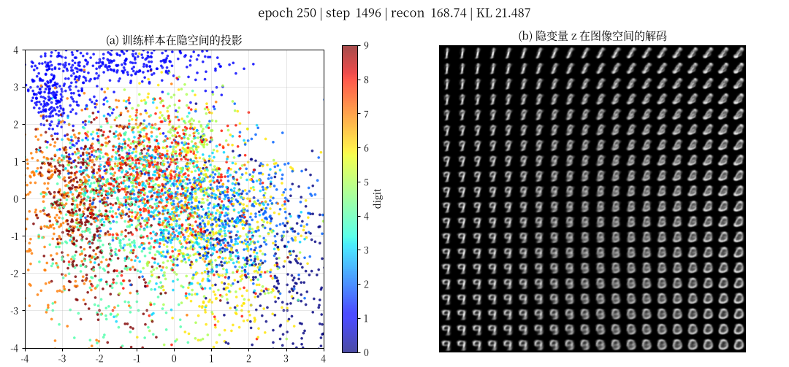

# VAE on MNIST — 隐空间学习过程可视化

在 MNIST 上训练一个**卷积变分自编码器(2 维隐空间)**,并把训练过程录成视频:
每隔若干训练步截一帧,左边是测试样本在 2 维隐空间的投影(按数字着色),
右边是在 2 维 `z` 网格上解码出的图像流形——对应教材图 16.6(a)(b)。
训练收敛后自动合成一段 mp4(默认 10fps,即每帧 0.1s)。



## 环境(uv)

```bash
uv venv --python 3.12
source .venv/bin/activate
uv pip install torch torchvision --index-url https://download.pytorch.org/whl/cu128  # RTX 5090 (Blackwell) 需 cu128
uv pip install numpy matplotlib imageio imageio-ffmpeg scikit-learn
```

## 运行

```bash
python train.py --epochs 250 --batch 10240 --ch 256 --snap-every 8 --lr 3e-3 --out runs/main
```

产物在 `runs/main/`:
- `vae_latent_learning.mp4` —— 学习过程视频
- `frames/` —— 每一帧 PNG
- `vae_final.pt` —— 训练好的权重

## 主要参数

| 参数 | 含义 | 默认 |
|---|---|---|
| `--batch` | batch 大小(越大越吃显存/CUDA) | 4096 |
| `--ch` | 卷积基础通道数(越大越吃显存) | 128 |
| `--zdim` | 隐空间维度(=2 便于可视化) | 2 |
| `--snap-every` | 每多少 step 截一帧 | 10 |
| `--fps` | 视频帧率(10 = 每帧 0.1s) | 10 |
| `--epochs` / `--lr` / `--beta` | 训练轮数 / 学习率 / KL 权重 | 100 / 2e-3 / 1.0 |

## 5090 (32GB) 显存调参

显存与 CUDA 利用率主要由 `--batch` 和 `--ch` 决定。实测:
- `--batch 8192  --ch 256` → 约 18.7 GB
- `--batch 10240 --ch 256` → 约 31 GB(占满 ~95%,GPU 利用率 100%)

按需在两者之间取舍即可。

## 模型与目标

- 编码器 `q(z|x)=N(μ_φ(x), σ_φ²(x))`,解码器 `p(x|z)` 为伯努利(BCE);
- 目标 = 重构(BCE)+ `β`·KL,其中 `KL(N(μ,σ²)‖N(0,I))` 用闭式;
- 用重参数化 `z=μ+σ⊙ε` 使梯度可回传到编码器。
